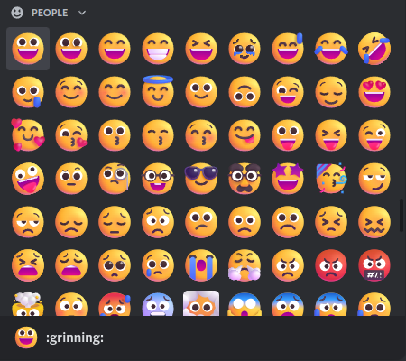

# FluentEmoji 

Brings [fluent emojis](https://github.com/microsoft/fluentui-emoji) to the Discord client.

## Disclaimer

Due to trademarks related issues, Microsoft did not open-source the following emojis: **Man Technologist**, **Video Game** and **Paperclip**. They also did not make any country flags and regional indicators.

As of today, Microsoft is still working on the following emojis: **Holding hands**, **Kiss**, **Couple with Heart** and **Family**.

Read more about it [here](https://github.com/microsoft/fluentui-emoji/issues/28).

Preview:  

See the [CHANGELOG](CHANGELOG.md).
